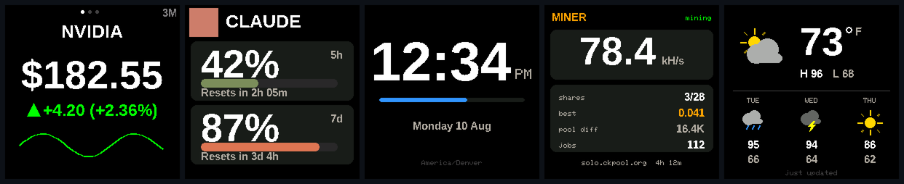

<h1 align="center">smalltv-plus</h1>

<p align="center">
  <a href="https://github.com/hratterman/smalltv-plus/actions/workflows/build.yml"></a>
  <a href="LICENSE"></a>
  
</p>

> A fork of [giovi321/smalltv-mod](https://github.com/giovi321/smalltv-mod) — open firmware for the
> GeekMagic SmallTV family of desk cubes. The upstream project's three modes grew here into eleven,
> plus a USB tether that gives the cube internet with no WiFi at all, real typography on the panel,
> and a bitcoin miner rebuilt in the open. Not affiliated with GeekMagic or Anthropic; this firmware
> replaces the stock firmware entirely.

<p align="center">
  
</p>

## What it shows

One image carries every mode; you pick one in the web UI, rotate through them on a carousel, or
step through them with a tap on the lid.

- **Stock & crypto ticker** — price, change, sparkline chart, portfolio P/L. Yahoo Finance,
  stockanalysis.com (with automatic failover between them), cash.ch for Swiss instruments, or your
  own webhook.
- **Weather** — current conditions with drawn icons, today's high/low, three-day forecast. Powered
  by Open-Meteo: no API key, no account; set your location by typing a city name.
- **Clock** — three faces: classic pixels, real sans type, or seven-segment alarm-clock digits.
  NTP-synced, 12/24h, seconds bar, night schedule.
- **Calendar** — your next obligation with a live countdown, then what follows. Easiest setup is
  pasting a calendar's secret iCal link; Google and Microsoft OAuth are supported too, including an
  on-device code flow for Outlook.
- **Claude usage meter** — 5-hour and 7-day usage bars with an animated pixel mascot, fed by the
  [clawdmeter-daemon](https://github.com/giovi321/clawdmeter-daemon).
- **Plane radar** — live ADS-B scope centred on your location, from adsb.fi.
- **Bitcoin miner** — a real solo lottery miner against your own pool, ported from NerdMiner_v2
  onto this hardware's SHA engine (~375 kH/s hybrid, every optimisation measured on-device).
- **Spotify now playing** — art, track, artist, progress; can take the screen automatically while
  music plays.
- **Ambient patterns** — Conway's Life, plasma, starfield, rain, fireworks; pick which ones and
  how they rotate.
- **Blackjack** — played entirely with the lid's touch pad.

## Beyond the modes

- **The USB tether.** Plug the cube into any computer and open a single static web page: the cube
  borrows that browser's internet — no WiFi ever needed. The same page is a full control panel
  (settings, city lookup for weather, calendar file drop) and can **flash firmware updates over the
  cable**, so a tethered cube is never stranded. It installs as a desktop app, reconnects by itself
  when replugged, and includes a network health check that tells "cube problem" from "network
  problem" in one glance. See [docs/tether-hosting.md](docs/tether-hosting.md) for standing it up.
- **A typeface setting.** The classic pixel look, or real rasterised type (LiberationSans) across
  the whole system — big numerals, headings, labels, the clock. The fonts are generated,
  self-tested against every screen's layout budget, and previewed pixel-for-pixel before they ever
  touch the panel (`tools/gen_font.py`, `tools/render_faces.py`).
- **Touch controls.** Tap steps modes, double-tap blanks the screen, long-press does something
  useful per mode (radar range, ambient pattern, blackjack input).
- **Night mining.** On a schedule the screen goes fully dark, rendering stops, and every cycle
  goes to the miner. A tap wakes the screen for a look.
- **Work mode.** One switch: mining refused outright on the office network, explicit words masked
  on screen.
- **Notifications.** `POST /notify` flashes a banner on the cube from anything on your LAN.
- **Diagnostics that speak.** Fetch failures name the host, HTTP code, resolved IP, and TLS error
  on screen; `/api/status` and the tether page carry the same detail. A custom-DNS setting routes
  around filtering resolvers on hotel/hotspot networks.

## Which cube do I have

The build targets five boards from one codebase. Check before flashing — the variants install
differently.

| | SmallTV (ESP8266) | SmallTV-ultra | SmallTV (ESP32-C2) | NM-TV-154 (ESP32) | SmallTV Pro (ESP32) |
|---|---|---|---|---|---|
| MCU | ESP-12F, 4 MB | same ESP-12F | ESP32-C2 / ESP8684, 4 MB | ESP32-WROOM-32E, 4 MB | classic ESP32, 8 MB |
| Build env | `smalltv` | `smalltv` (install via `smalltv_loader`) | `smalltv_c2` | `smalltv_esp32` | `smalltv_esp32_8mb` |
| Flashing | OTA from stock web UI, or UART | two-step loader, then OTA | USB-C (esptool, CH340C) | USB (esptool) | OTA from stock web UI |
| Tell-tale | ESP8266 module, no USB-serial chip | stock firmware branded "Ultra" | CH340C beside the USB-C port | PCB reads "NM-TV-Miner" | sold as "SmallTV Pro", touch button |

All five share the same 1.54" 240×240 ST7789 IPS panel. Full teardown photos and pin maps are in
the [upstream hardware docs](https://giovi321.github.io/smalltv-mod/getting-started/hardware/).

## Building and flashing

Requires [PlatformIO](https://platformio.org/). Pick the env for your board:

```bash
pio run -e smalltv_esp32           # NM-TV-154 (classic ESP32)
pio run -e smalltv                 # ESP8266
pio run -e smalltv_c2              # ESP32-C2
pio run -e smalltv_esp32_8mb       # SmallTV Pro (classic ESP32, 8 MB)
pio run -e smalltv_c2 -t upload    # build + flash the C2 over USB-C
pio device monitor                 # serial logs @ 115200
```

Every push also builds all five targets in CI; the images land as a workflow artifact
(`smalltv-plus-firmware`) on the [Actions page](../../actions).

- **First flash on USB-capable boards** (`esptool`): write `firmware.factory.bin` at `0x0`. Back
  up the stock image first (`read_flash 0x0 0x400000 stock-backup.bin`).
- **First flash on OTA-only boards**: upload the matching `firmware.bin` through the stock web UI
  (the ultra needs the two-step loader — see the
  [upstream flashing guide](https://giovi321.github.io/smalltv-mod/getting-started/flashing/)).
- **After the first flash**: update from the web UI's Update tab over WiFi — or over the USB
  tether, no WiFi involved.

## First-time setup

1. On first boot the cube shows **SETUP MODE** and creates an open `SmallTV-Setup` hotspot.
2. Join it; a captive portal opens (or browse to `http://192.168.4.1`).
3. Pick your 2.4 GHz network under **WiFi** and save. The cube reboots and joins.
4. It shows its IP and `http://<hostname>.local` on screen — open either in a browser.
5. Configure any mode in its own tab. The ticker works immediately with a few symbols
   (`AAPL`, `BTC-USD`); weather needs only a city lookup.

No WiFi available at all? Skip everything above and use the
[USB tether](docs/tether-hosting.md) instead.

## Documentation

- [Hosting & using the USB tether](docs/tether-hosting.md) — the handoff guide
- [What works over the tether, measured](docs/tether-limits.md) — per-service CORS findings
- [Upstream docs](https://giovi321.github.io/smalltv-mod/) — hardware, flashing, recovery, and the
  original three modes in depth

## Development

The firmware is exercised without hardware wherever possible: **16 host-side self-test suites**
(`tools/*_selftest`) cover the ICS/RRULE calendar engine, the generated fonts against every
screen's layout budget, the WMO weather mapping, the serial framing, HTTP chunk decoding, the
miner's protocol arithmetic, and more. `tools/render_faces.py` renders every screen to PNG from
the same generated data the firmware compiles, so visual changes are reviewed before they are
flashed. CI builds all five targets on every push.

## Credits & license

Forked from [giovi321/smalltv-mod](https://github.com/giovi321/smalltv-mod), which carries the
hardware bring-up, the original three modes, the web UI foundation, and the docs site. The miner
core is ported from [NerdMiner_v2](https://github.com/BitMaker-hub/NerdMiner_v2). Licensed
[WTFPL](LICENSE), same as upstream.
